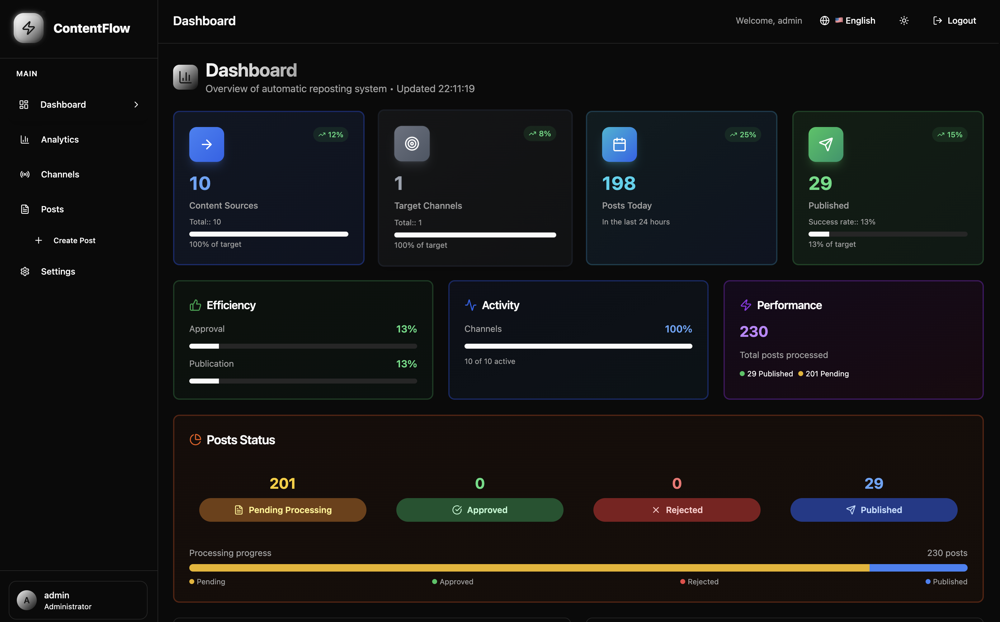
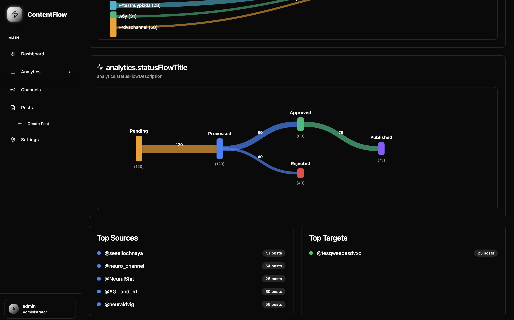

# ContentFlow


  [](https://opensource.org/licenses/MIT)
  [](https://www.python.org/downloads/)
  [](https://fastapi.tiangolo.com/)
  [](https://reactjs.org/)
  [](https://www.docker.com/)

<div align="center">
  
  
  **Smart platform for automatic monitoring and reposting content from Telegram channels with AI processing**

</div>

## ✨ Features

- 🤖 **AI Moderation** - Automatic content filtering using LLM
- 📊 **Channel Monitoring** - Track new posts in Telegram channels
- 🎯 **Smart Reposting** - Automated publishing with custom settings
- 📈 **Analytics** - Statistics and performance metrics
- 🔧 **Web Interface** - Convenient management through browser

## 📸 Screenshots

<div align="center">
  
### Dashboard


### Analytics


</div>

## 🚀 Quick Start

### Requirements
- Docker and Docker Compose
- Telegram API credentials
- OpenRouter API key (for AI)

### Installation

1. **Clone the repository**
```bash
git clone https://github.com/username/contentflow.git
cd contentflow
```

2. **Configure environment variables**
```bash
cp .env.example .env
# Edit .env file with your credentials
```

3. **Start the application**
```bash
docker-compose up -d
```

4. **Open web interface**
```
http://localhost:3000
```

## 📝 Configuration

| Variable | Description | Example |
|----------|-------------|---------|
| `TELEGRAM_API_ID` | Telegram app ID | `12345678` |
| `TELEGRAM_API_HASH` | Telegram app hash | `abcdef...` |
| `OPENROUTER_API_KEY` | AI processing key | `sk-or-...` |
| `DATABASE_URL` | Database URL | `postgresql://...` |

## 🤝 Contributing

1. Fork the repository
2. Create a feature branch (`git checkout -b feature/amazing-feature`)
3. Commit your changes (`git commit -m 'Add amazing feature'`)
4. Push to the branch (`git push origin feature/amazing-feature`)
5. Open a Pull Request

## 📄 License

This project is licensed under the MIT License - see the [LICENSE](LICENSE) file for details.

## 🆘 Support

- 🐛 [Report a bug](https://github.com/username/contentflow/issues)
- 💡 [Request a feature](https://github.com/username/contentflow/issues)
- 💬 [Discussions](https://github.com/username/contentflow/discussions)

---

<div align="center">
  <strong>Made with ❤️ for content automation</strong>
</div>
